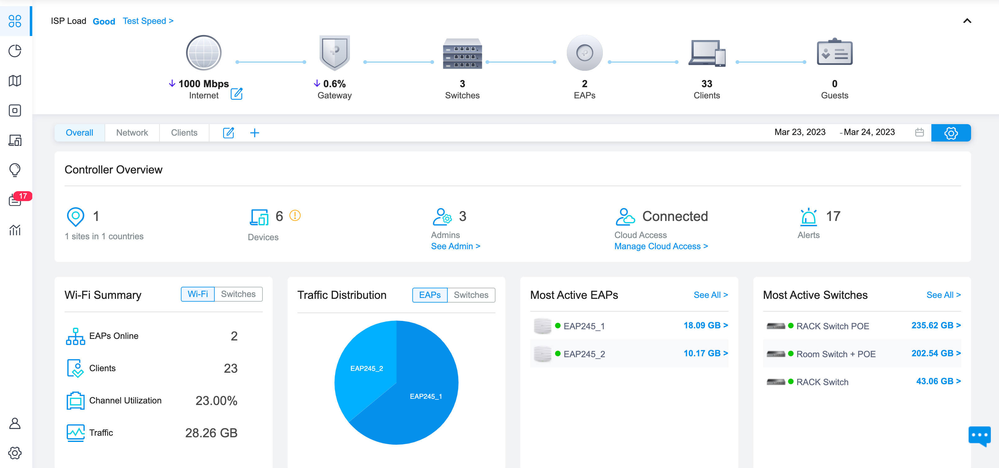

# Kalindu's Homelab
> [https://kdecosta.com/homelab/](https://kdecosta.com/homelab/)

 

This repository contains the a collection of documentation and the architecture my [homelab](https://www.reddit.com/r/homelab/wiki/introduction/) which includes network architecture as well as IoC and scripts used for automation of hosted services.

## Lab goals

### Managed Network (Omada)
1. VLANs for device groups
2. Custom SSIDs
3. Network throughput monitoring
4. Support POE devices
5. Custom recursive DNS server / Local DNS

### Hosted Services
1. Virtualized containers
2. Kubernetes for service management
3. Monitoring with Prometheus and Grafana
4. GitLabs server for GitOps / deploys
5. VPN for remote management
6. Load-balancer (envoy / ingress-nginx)

### Backup / Archival Storage
1. TrueNAS for archival and backup storage

### IoC and GitOps
1. Ansible for container automation
2. Terraform for infrastructure management
3. ChatOps (slack??)

### Security / Resiliency
1. Certificate management
2. Cloudflare tunnel for exposed services

## Demos and Screenshots

## License

Distributed under the [MIT License](https://github.com/kalindudc/homelab/blob/main/LICENSE), go nuts.

