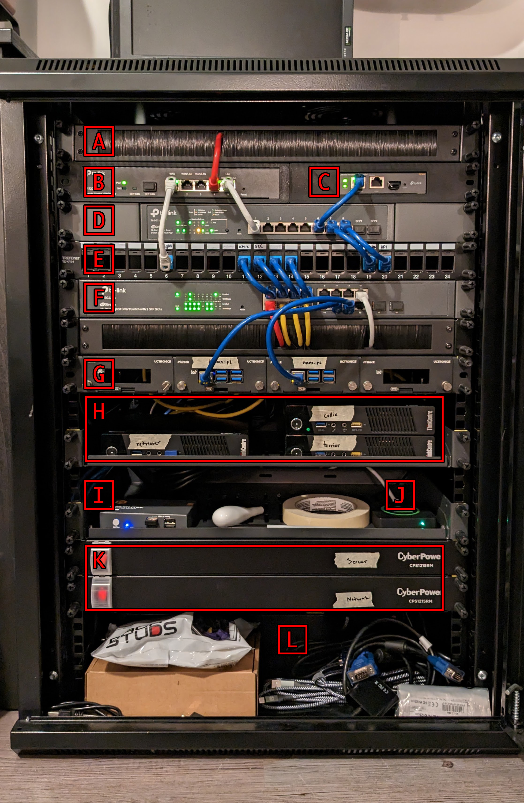
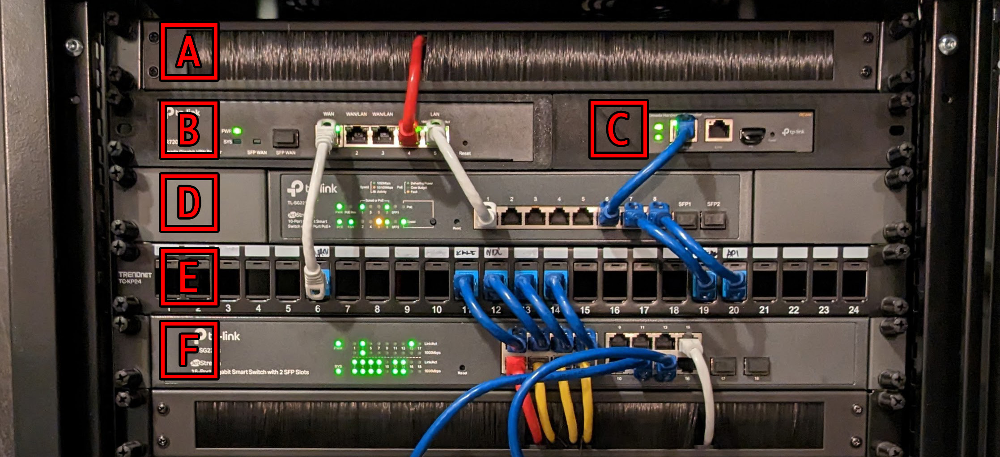
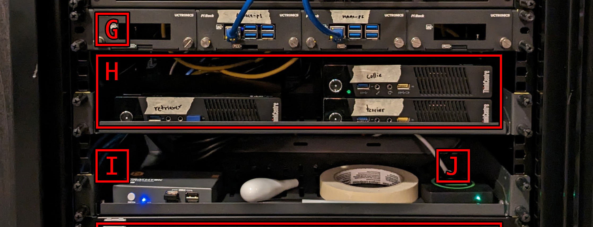
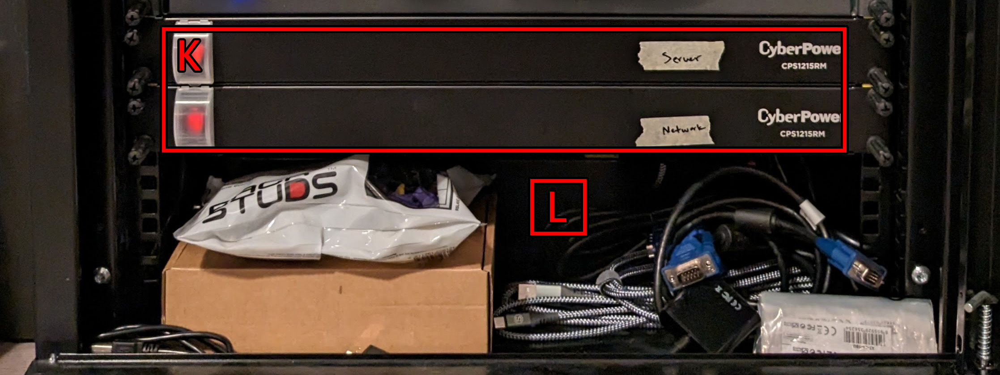
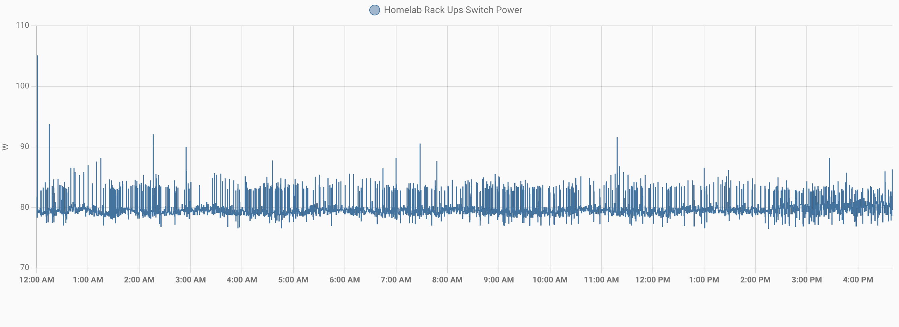
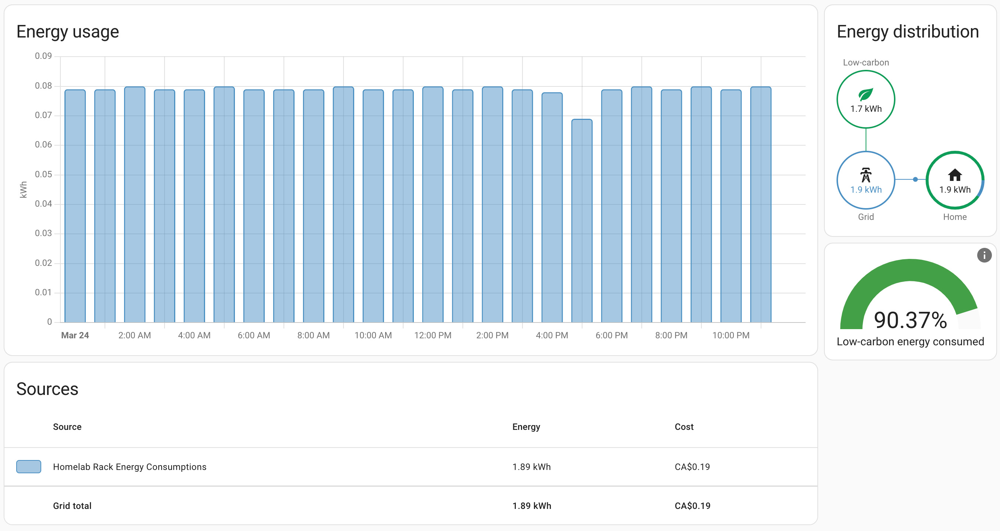
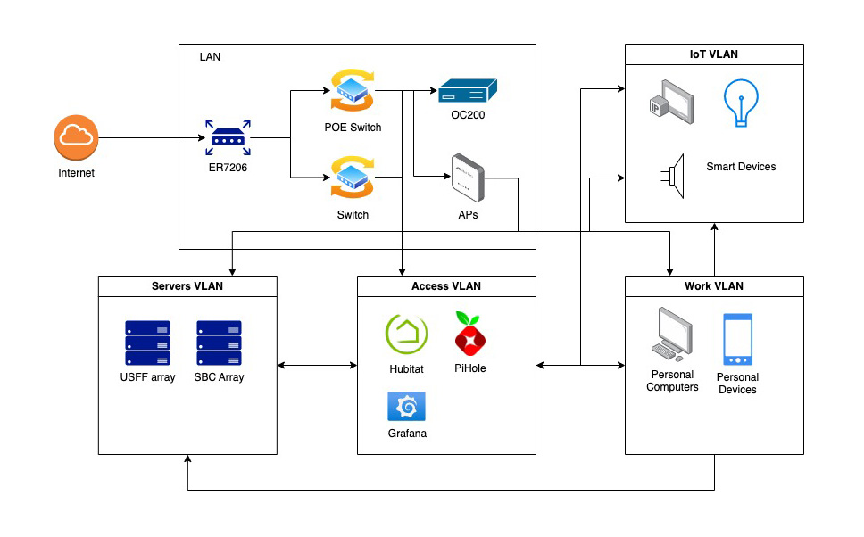

---
tags:
  - hardware
  - rack
  - lab
---
# The Journey Begins - 2023/03/24

## Overview

This is the first update of the lab. I am planning to post an update at least twice a year, but let's see how the lab will progress. I am going to try to go into as much detail as possible on the hardware choices, organization and types of services.

Lets, begin...

## Hardware breakdown
The lab is still it it's early stages. I am still figuring out the organizations and the choice of hardware to best achieve the goals for this project. Before getting into all the specifics, let's go over the hardware.

| Legend |
| - |
| **A.** Brush panel |
| **B.** ER7206 (router) |
| **C.** OC200 (cloud controller) |
| **D.** TL-SG2210MP (POE switch) |
| **E.** Patch Panel |
| **F.** TL-SG2218 (16 Port switch) |
| **G.** SBC array (BananaPI-M5 x2) |
| **H.** USFF array (ThinkCenter M73 x3) |
| **I.** 2 port KVM switch |
| **J.** Hubitat C-7  |
| **K.** CyberPower CPS1215RM (10 Port PDU x2) |
| **L.** CyberPower EC850LCD UPS |

Top down I am organizing the rack in to 3 sections, **network**, **servers**, and **power** with some basic organization panels added in between. I have 15U of space for this organization and for now I am dedicating 6U of space for the network section, 5U for the server section and 4U for the power section. There is a lot or room for improvement here, but with the equipment I have this is the best way I can think of to organize the hardware for easy access and "clean" cable management.

### Network

I decided very early on to stick to a single ecosystem for my networking gear, primarily for the ease of use and integration and for the community support. There were a few options here, Ubiquity (r/homelabs favourite), Omada, Cisco, Aruba ... My homelab journey started in late 2021, well into the global supply chain issues and getting anything Ubiquity was nearly impossible. Cisco and Aruba had a great community behind it but was too expensive for a home setup and that left TPLink Omada, somewhat underrated and so far has worked really well for this project.

To start this section, there is a brush panel [A]. It's mostly there as a filler and for some organization. In the future, I am planning to get rid of this panel to make some room for a another switch or a 1U server. Next we get to the interesting bits. First we start with the ER7206 (gigabit router) [B] and the OC200 (cloud controller) [C] fitted into a custom 3D printed rack mount case that I got through [etsy](https://www.etsy.com/ca/listing/1394132419/rack-mount-for-tp-link-omada-er7206-and?ga_order=most_relevant&ga_search_type=all&ga_view_type=gallery&ga_search_query=er7206+rack+mount&ref=sr_gallery-1-2&sts=1&organic_search_click=1). The OC200 is really handy and enables automatic hardware provisioning and provides very easy to use Omada dashboard along with remote management for all your adopted Omada devices. It's really just plug-n-play and is very beginner friendly. My only experience with networking before starting this journey was port-forwarding through my ISP provided modem/router combination device.

Next, I have a TL-SG2210MP, an 8 port POE switch [D] and a patch panel [E]. I found these second hand for very cheap and it has worked without any issue for the past 2ish years now. The OC200 and all my home APs are POE powered. I will eventually have to upgrade this something like a 16 or a 24 port POE switch when I add a few more POE cameras into my home and eventually convert all The SBCs in the rack to power over POE.

To finish off this section, I have a TL-SG2218, a 16 port switch [F] and another brush panel for some organization. I am very quickly running out of ports for this switch.

### Server

This section is really the meat of the lab. It starts with my SBC array [G], so far I only have 2 BananaPI M5s. I want to add a couple more SBCs in here and try to power it all with POE (raspberry PIs please come back :disappointed:).

Next, I have the USFF array [H]. This is my virtualization cluster running Proxmox VE. They are all used stock ThinkCenter M73s (around $50 - $80 on marketplace), eventually I want to upgrade these with some 4tb SSDs and max out the RAM (16gb DDR3). I decided to go with some Tiny PCs here because of 1. costs, they are very cheap and 2. rack space. This rack is a very short depth rack and standard depth servers are impossible to fit. Even some short depth servers are a tough fit.

To finish off this section, I have a 2 port KVM switch [I] and a Hubitat C-7 [J]. The KVM switch is really underpowered and not super useful. I want to switch this out for a good, 8 port KVM switch or a DIY PiKVM solution.

### Power (and storage)

The final section, power and sort of storage. This section is really not organized well. The first two are CyberPower CPS1215RMs [K], some basic 10 outlet PDUs connected to the CyberPower EC850LCD UPS [L]. During a power outage, this provides about 10-15 minutes of continuous power, which is plenty to safely power off the servers. Plus, the UPS supports data over USB to run some automation to safely shutoff critical devices when running off the battery.

## Energy usage

On average the whole rack draws around 83W of power, this roughly translates to around $5-$6 / month, here in Ontario, Canada. This is really not too bad considering the capabilities of the lab. I could probably improve this further by picking some more efficient USFF computers, but I am quite happy with the current energy usage.

#### Daily power draw

#### Daily energy cost

## Network and Services

Ok so, the hardware is nice, but what do I really run with all this? Well first, let's take a look at how the network devices are connected. One of the goals I have for this project is to learn more about VLANs and L3 network management.

### Network topology

