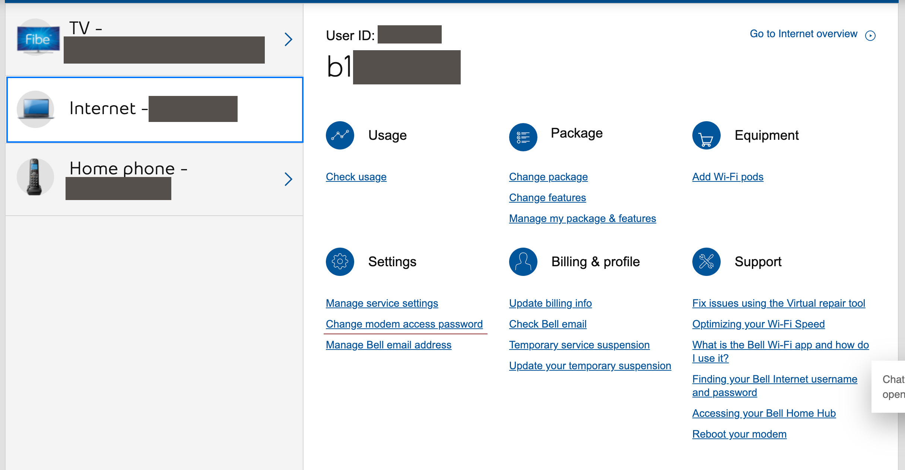
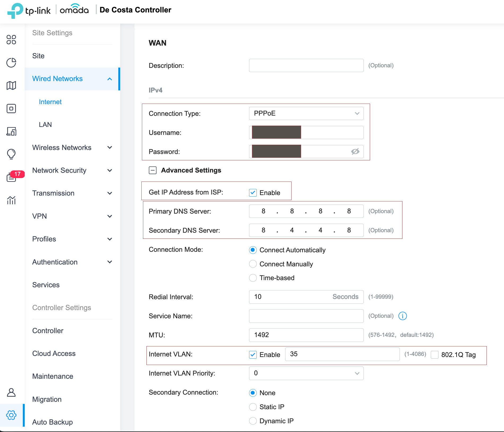

# Bypass Bell HomeHub 4000
> Just let me use my own hardware :'(

Bell Canada provides an all in one proprietary hardware solution for home networking. This is quite limited for my overall goals for this project. Using my own networking hardware allows to easily switch ISPs and without having to lockin to a single ISP. Using my own hardware also allow for better security and resiliency with better community support. For the purposes of this guide, I have the `HomeHub 4000` and all instructions are for working with the `HomeHub 4000`.

## Option 1: Advanced DMZ

!!! failure "Update 2023/02/02"
    This does not work for me anymore. A firmware update to the HH4000 somehow blacklisted my router. Enabling `Advanced DMZ` for the router now results in an invalid public ip for the router, and breaks the internet connection to the HH4000 as well.

#### Turn ON DMZ
1. Connect router to one of the LAN port (or the 10G port)
2. Visit `192.168.2.1`, enter HH4000 password `(defaults to the serial number of the device)`
3. Go to `Advanced Tool and Settings`
4. Click on `DMZ`
5. Enable `Advanced DMZ`
6. From the list of devices, locate the `MAC` address of the router
7. Click on the router and select `Activate Device`
8. Save!

#### Additional Settings
1. Go to `Advanced Tool and Settings`
2. Turn **OFF** `UPnP, DLNA, and SIP ALG`
3. Select `WIFI` and disable the onboard wifi, we will be using our own router and APs

### Calibration Steps

1. Turn OFF both your router and the HH400 (pull the power cords) for 5-10 mins
2. Turn ON the router and let is completely boot up (this **HAS** to power on first)
3. Turn ON the HH400

The router should now receive a valid IP and internet. If not, try the above steps again.

!!! note
    In the event of a power failure, you may have to repeat the above steps for the router to receive a valid public IP. I would first try with the `Calibration Steps` first to see if the router can acquire a valid public IP.

## Option 2: PPPoE Passthrough

#### Turn OFF unnecessary settings
1. Connect router to one of the LAN port (or the 10G port)
2. Visit `192.168.2.1`, enter HH4000 password `(defaults to the serial number of the device)`
3. Go to `Advanced Tool and Settings`
4. Turn **OFF** `UPnP, DLNA, and SIP ALG`
5. Select `WIFI` and disable the onboard wifi, we will be using our own router and APs

#### Find your PPPoE credentials
1. Login to myBell
2. Go to `My Services > Internet` and record the userID (it should start with `b1`)
3. Under `Settings`, select `Change modem access password` and create a new access password

#### Configure your router

I currently use a TPLink ER7206 as my router and I will be using this as an example of configuring PPPoE passthrough.

1. Head over to `Settings > Wired Networks > Internet`
2. Select the appropriate `WAN` setting, I am using the regular RJ45 `WAN` port on the router to connect to HH400
3. Set `Connection Type` to **PPPoE**
4. Add the bell PPPoE credentials (the username/password that were acquired in the previous step)
5. Expand `Advanced Settings`
6. Enable `Get IP Address from ISP`
7. Change the DNS Server to your preferred DNS server provider, I am going use google (8.8.8.8/8.4.4.8)
8. Enable `Internet VLAN` and use **35** as the tagged value
9. Restart the router!!!

