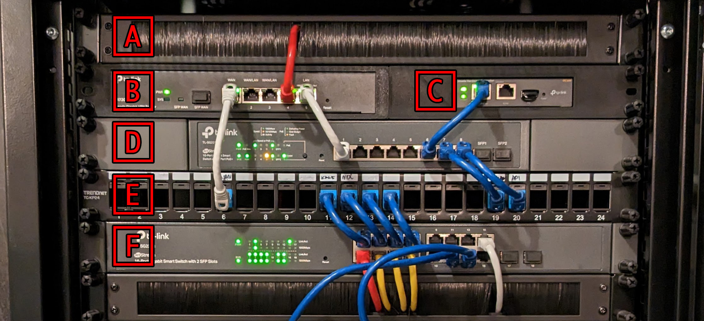

---
tags:
  - networking
  - omada
  - homehub
---
# Network

Oh the glorious network.

Ok let's talk about the network. Can I do everything I am currently doing with just the boring ol' HomeHub provided by Bell? Yes. But is it as cool as the setup in the lab, Nope, not even close. My ultimate goal for the network in the lab is security and resiliency for all the devices and users in my home, quick monitoring and throughput control of clients, and most importantly, to be completely independent from my ISP (Bell canada :no_good:).

My goals for the network is to learn more about network management and configuration. I currently work as an `Infrastructure Engineer` and I am using the lab as a learning opportunity to improve my skills in network management, VPC / firewall architecture, VLAN management, etc. This section of the site will be updated frequently, for a full timeline of events, checkout [the lab](../lab/index.md).

!!! warning
    Some of the blurbs and detail below are grabbed straight out of the first lab update. To see a full in-depth detail on the lab, check out, [`The Journey Begins` lab update](../lab/updates/update_20230324.md).

## ISP and the internet package

I live in Canada, so my choices of ISPs are very limited. There is Bell, Rogers, .... and that's about it. Every other provider is a subsidiary of Bell or Rogers. To make things worse my residential neighbourhood only supports Bell :facepalm:. So I am stuck with bell. I am using a `1.5Gb` Fiber package from Bell, but my network gear only support gigabit so there is some unused bandwidth :shrug:. The worst part of bell is the proprietary modem/router combo they provide, the dreaded HomeHub 4000. It lacks even the most basic of features like a bridge mode to use your own hardware. Not to worry though, there is a way...

!!! note "How can I bypass the Bell HomeHub 4000?"
    It's pretty simple, I have a guide for it. Check out, [Bypass Bell Home Hub 4000](./bypass_bell_homehub.md).

## The gear

I decided very early on to stick to a single ecosystem for my networking gear, primarily for the ease of use and integration and for the community support. There were a few options here, Ubiquity (r/homelabs favourite), `Omada`, Cisco, Aruba ... My homelab journey started in late 2021, well into the global supply chain issues and getting anything Ubiquity was nearly impossible. Cisco and Aruba had a great community behind it but was too expensive for a home setup and that left TPLink `Omada`, somewhat underrated and so far has worked really well for this project.

To start this section, there is a brush panel [A]. It's mostly there as a filler and for some organization. In the future, I am planning to get rid of this panel to make some room for a another switch or a 1U server. Next we get to the interesting bits. First we start with the ER7206 (gigabit router) [B] and the OC200 (cloud controller) [C] fitted into a custom 3D printed rack mount case that I got through [etsy](https://www.etsy.com/ca/listing/1394132419/rack-mount-for-tp-link-`Omada`-er7206-and?ga_order=most_relevant&ga_search_type=all&ga_view_type=gallery&ga_search_query=er7206+rack+mount&ref=sr_gallery-1-2&sts=1&organic_search_click=1). The OC200 is really handy and enables automatic hardware provisioning and provides very easy to use `Omada` dashboard along with remote management for all your adopted `Omada` devices. It's very beginner friendly. My only experience with networking before starting this journey was port-forwarding through my ISP provided modem/router.

Next, I have a TL-SG2210MP, an 8 port POE switch [D] and a patch panel [E]. I found these second hand for very cheap and it has worked without any issue for the past 2ish years now. The OC200 and all my home APs are POE powered. I will eventually have to upgrade this to something like a 16 or a 24 port POE switch when I add a few more POE cameras into my home and eventually convert all The SBCs in the rack to power over POE.

To finish off this section, I have a TL-SG2218, a 16 port switch [F] and another brush panel for some organization. I am very quickly running out of ports for this switch and I will probably upgrade this switch in the next few months.

## Network topology

There are 4 distinct VLANs in use within in my network. `IoT` VLAN for grouping all IoT devices, these include smart home devices, media devices, appliances, etc. `Work`, groups together all personal devices in the home like desktop computers, laptops, phones. This is also the primary VLAN for the the home WiFi. `Access`, is reserved for devices that require acccess to everything on the network, like DNS service, monitoring and log aggregation services. Finally, the `servers` VLAN groups together all devices that act as servers in the lab like the SBC array, USFF array and the NAS server.

The `IoT` devices are isolated from most other devices. Most devices on the `IoT` group does not require any communication with any other VLANs. Similarly, None of the VLANs are allowed to communicate with devices in the top level `LAN` group which includes the network devices. One of the devices I regret not including in the `IoT` VLAN is the Hubitat, I included it in the `access` VLAN to avoid some connectivity issues however, I think this was a configuration error on my part. I could spend a weekend re-configuring the Hubitat into the `IoT` VLAN, but I plan completely remove this device in favour of Zigbee and ZWave integration directly into the Home Assistant deployment. I am currently only using the Hubitat as a middle man to communicate with Zigbee / ZWave devices and all my home automation is done through Home Assistant.

